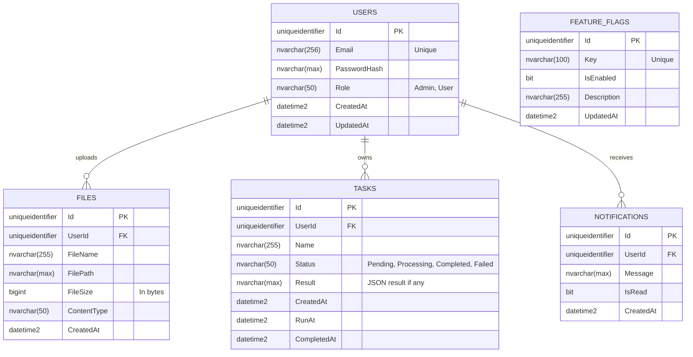

# 03 - Entity Relationship Diagram (ERD)

## 1. Biểu đồ quan hệ thực thể (ER Diagram)

---

## 2. Chi tiết các bảng (Table Details)

### 2.1. Bảng `Users`
Lưu trữ thông tin người dùng và phân quyền cơ bản.
- `Id` (GUID): Primary Key.
- `Email` (VARCHAR/NVARCHAR): Email đăng nhập, Unique Index.
- `PasswordHash` (NVARCHAR): Mật khẩu đã được mã hóa.
- `Role` (NVARCHAR): Vai trò (VD: `Admin`, `Tenant`).
- `CreatedAt`, `UpdatedAt`: Thời gian tạo và cập nhật.

### 2.2. Bảng `Files`
Lưu thông tin metadata của các file người dùng đã upload. (File vật lý lưu ở Storage như Local Disk, S3...).
- `Id` (GUID): Primary Key.
- `UserId` (GUID): Foreign Key trỏ tới `Users`.
- `FileName` (NVARCHAR): Tên file gốc.
- `FilePath` (NVARCHAR): Đường dẫn tương đối hoặc URL lưu trữ.
- `FileSize` (BIGINT): Kích thước file (bytes).
- `ContentType` (NVARCHAR): Loại MIME (VD: `image/jpeg`).

### 2.3. Bảng `Tasks`
Lưu thông tin về các tác vụ chạy nền (Background Jobs).
- `Id` (GUID): Primary Key.
- `UserId` (GUID): Foreign Key trỏ tới `Users`.
- `Name` (NVARCHAR): Tên hoặc mô tả tác vụ.
- `Status` (NVARCHAR): Trạng thái (Pending, Processing, Completed, Failed).
- `RunAt` (DATETIME): Thời gian lên lịch chạy.

### 2.4. Bảng `Notifications`
Lưu trữ các thông báo gửi đến người dùng.
- `Id` (GUID): Primary Key.
- `UserId` (GUID): Foreign Key trỏ tới `Users`.
- `Message` (NVARCHAR): Nội dung thông báo.
- `IsRead` (BIT): Đánh dấu đã đọc (0: Chưa đọc, 1: Đã đọc).
- `CreatedAt` (DATETIME): Thời gian thông báo được tạo.

### 2.5. Bảng `FeatureFlags`
Quản lý trạng thái bật/tắt các tính năng của hệ thống.
- `Id` (GUID): Primary Key.
- `Key` (NVARCHAR): Mã tính năng (VD: `EnableNewUI`, `BetaUpload`), Unique Index.
- `IsEnabled` (BIT): Trạng thái (1: Bật, 0: Tắt).
- `Description` (NVARCHAR): Mô tả tính năng.