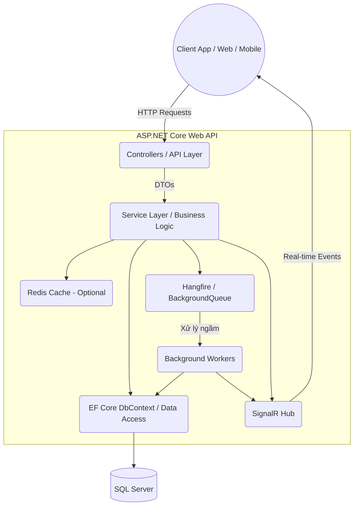

# 05 - Architecture & Workflow

## 1. Sơ đồ Kiến trúc (Architecture Pattern)

---

## 2. Giải thích chi tiết các thành phần

### 2.1. API Layer (Controllers)
- **Nhiệm vụ**: Nhận HTTP Requests, thực hiện cơ chế xác thực và phân quyền (Authentication/Authorization) thông qua JWT Middleware.
- **Xử lý**: Validate dữ liệu đầu vào (ModelState, FluentValidation), gọi các method từ Service Layer, và trả về HTTP Status code tương ứng.

### 2.2. Service Layer (Business Logic)
- **Nhiệm vụ**: Chứa toàn bộ core logic của ứng dụng.
- **Nguyên tắc**: Tách biệt hoàn toàn với logic HTTP hay cách lưu trữ dữ liệu. Controller không bao giờ gọi trực tiếp DbContext mà phải thông qua Service.

### 2.3. Data Access Layer (EF Core DbContext)
- **Nhiệm vụ**: Chịu trách nhiệm tương tác trực tiếp với cơ sở dữ liệu.
- Sử dụng Entity Framework Core để map objects thành các record trong Database (O/R Mapping).

### 2.4. Storage (Database & Files)
- **SQL Server**: Nơi lưu trữ toàn bộ dữ liệu có cấu trúc.
- **Local File System / S3**: Nơi lưu trữ vật lý cho các file upload.

---

## 3. Các thành phần mở rộng (Optional / Advanced)

- **SignalR Hub**: Xử lý WebSockets, cho phép đẩy (push) notifications hoặc realtime updates từ Server về Client (ví dụ: thông báo khi file đã upload xong, hoặc task chạy nền hoàn thành).
- **Hangfire / Background Tasks**: Queue xử lý các tác vụ nặng (như gửi email, resize ảnh) tách biệt hoàn toàn với main thread của HTTP Request, giúp API phản hồi nhanh chóng (nhận request -> đưa vào queue -> trả về HTTP 202 Accepted).